# Incremental Backup and Merge Restore

## Architecture

```mermaid
flowchart TD
    subgraph backup_flow [Filtered Backup]
        B1[Parse --since / --recent] --> B2[Scan workspace DBs]
        B2 --> B3["Filter sessions by lastUpdatedAt >= cutoff"]
        B3 --> B4[Collect matching session IDs]
        B4 --> B5[Copy matching workspace DBs full]
        B4 --> B6[Create filtered global DB]
        B5 --> B7[Zip + manifest]
        B6 --> B7
    end

    subgraph restore_flow [Merge Restore]
        R1[Extract backup to temp] --> R1b[Build local path-to-hash map]
        R1b --> R2[Match backup workspaces by path]
        R2 -->|path not found locally| R3[Copy folder as-is]
        R2 -->|"path exists locally (same or different hash)"| R4[Merge into local hash DB]
        R3 --> R5["Global DB: INSERT OR IGNORE"]
        R4 --> R5
        R5 --> R6[Cleanup temp]
    end
```




## Feature 1: Date-Filtered Backup

The global DB (`globalStorage/state.vscdb`) stores all bubble data and is the main size contributor. A filtered backup creates a **partial global DB** with only matching sessions. Workspace DBs are small (metadata arrays) and get copied whole if they contain any matching session.

**CLI interface:**

```
cursor-history backup --since 2026-03-13
cursor-history backup --since "2026-03-13T10:00:00+09:00"
cursor-history backup -r 7d        # 7 days ago
cursor-history backup -r 2w        # 2 weeks ago
cursor-history backup --recent 4h  # 4 hours ago
```

`--since` and `--recent` are mutually exclusive.

### Changes

- **[src/core/types.ts](src/core/types.ts)** -- Add `since?: Date` to `BackupConfig`
- **[src/core/backup.ts](src/core/backup.ts)** -- Three new functions + modify `createBackup()`:
  - `getFilteredSessionIds(dataPath, since)` -- scan workspace DBs' `allComposers` arrays, return IDs where `lastUpdatedAt >= since`
  - `createFilteredGlobalDb(sourceDbPath, sessionIds, destPath)` -- create new DB with only matching `composerData:{id}` and `bubbleId:{id}:`* rows (batch inserts in a transaction)
  - `shouldIncludeWorkspace(dbPath, since)` -- quick check if a workspace has any matching session
  - Modify `createBackup()`: when `config.since` is set, skip non-matching workspace DBs and use `createFilteredGlobalDb()` instead of `backupDatabase()` for the global DB
- **[src/cli/commands/backup.ts](src/cli/commands/backup.ts)** -- Add `--since <date>` and `-r, --recent <duration>` options, with `parseSinceDate()` and `parseRecentDuration()` helpers. Duration format: `Nd` (days), `Nw` (weeks), `Nh` (hours)
- **[src/lib/types.ts](src/lib/types.ts)** -- Add `since?: Date` to library `BackupConfig`

### Filtered global DB creation (key logic)

```typescript
async function createFilteredGlobalDb(sourceDbPath, sessionIds, destPath) {
  // Open source read-only, create dest with cursorDiskKV table + index
  // BEGIN transaction
  // For each session ID:
  //   INSERT composerData:{id} row
  //   INSERT all bubbleId:{id}:* rows
  // COMMIT
}
```

## Feature 2: Merge Restore

**CLI interface:**

```
cursor-history restore backup.zip --merge
cursor-history restore backup.zip --merge --force   # proceed despite integrity warnings
```

`--merge` and bare `--force` (overwrite mode) are mutually exclusive.

### Changes

- **[src/core/types.ts](src/core/types.ts)** -- Add `merge?: boolean` to `RestoreConfig`. Extend `RestoreResult` with:

```
  mergeStats?: { sessionsAdded, sessionsUpdated, workspacesNew, workspacesMerged, globalRowsAdded }
```

- **[src/core/backup.ts](src/core/backup.ts)** -- New functions + modify `restoreBackup()`:
  - `buildLocalWorkspaceMap(localWorkspaceStorageDir)` -- scan all local `workspaceStorage/{hash}/workspace.json` files, return `Map<normalizedPath, localHash>`. Uses existing `readWorkspaceJson()` which handles both `folder` and `workspace` keys
  - `mergeWorkspaceDb(backupDbPath, localDbPath)` -- read `composer.composerData` from both, merge `allComposers` arrays: new sessions are added, existing sessions are **replaced if backup has a newer `lastUpdatedAt`** (handles conversations extended on the source). Returns `{ added, updated }` counts
  - `mergeGlobalDb(backupDbPath, localDbPath)` -- ATTACH backup DB, uses `**INSERT OR REPLACE` for `composerData:***` keys (so updated session headers with new bubble lists overwrite stale ones) and `**INSERT OR IGNORE` for `bubbleId:***` keys (immutable bubble content, new bubbles added). Returns net rows added
  - Modify `restoreBackup()` merge path:
    1. Extract backup to temp dir
    2. Build local workspace path-to-hash map via `buildLocalWorkspaceMap()`
    3. For each backup workspace folder, read its `workspace.json` to get the path:
      - **Path not found locally**: copy entire folder as-is (new workspace)
      - **Path found locally (same hash)**: merge `state.vscdb` via `mergeWorkspaceDb()`, skip `workspace.json`
      - **Path found locally (different hash)**: merge backup's `state.vscdb` into the **local hash's** `state.vscdb` via `mergeWorkspaceDb()`, do NOT copy the backup folder (would create orphan)
    4. Call `mergeGlobalDb()` for global DB
    5. Cleanup temp dir
    6. Return result with merge stats
- **[src/cli/commands/restore.ts](src/cli/commands/restore.ts)** -- Add `--merge` option, display merge stats (including `sessionsUpdated`), validate against bare `--force`
- **[src/lib/types.ts](src/lib/types.ts)** -- Mirror `RestoreConfig` and `RestoreResult` changes

### Merge behavior for existing sessions

When a session exists on both sides (same `composerId`):

1. **Workspace DB**: Compare `lastUpdatedAt` timestamps. If backup is newer, **replace** the session entry so the updated metadata (message count, title, etc.) is reflected locally.
2. **Global DB**: `composerData:`* entries use `INSERT OR REPLACE` so the updated header (including `fullConversationHeadersOnly` with new bubble IDs) overwrites the stale one. `bubbleId:*` entries use `INSERT OR IGNORE` since bubble content is immutable — new messages from the extended conversation get inserted, existing ones are preserved.

This means running `--merge` repeatedly is safe and idempotent: the newer version always wins, and no data is lost.

### Merge global DB (key logic, using ATTACH)

```typescript
function mergeGlobalDb(backupDbPath, localDbPath) {
  // ATTACH backup DB
  // INSERT OR REPLACE for composerData:* (session headers — newer wins)
  // INSERT OR IGNORE for bubbleId:* (immutable message content)
  // INSERT OR IGNORE for other keys
  // DETACH, return net rows added
}
```

## After both features ship

Update [LOCAL_MIGRATION.md](LOCAL_MIGRATION.md) to show the simplified workflow:

```
# On laptop: backup only recent sessions
cursor-history backup -r 8d

# On Mac Studio: merge into existing data
cursor-history restore backup.zip --merge
```

## Out of scope

- `--since`/`--recent` for restore (filtering which sessions to import from a backup)
- The `--target` path `dirname()` confusion in restore -- separate fix
- Automatic network sync between machines

